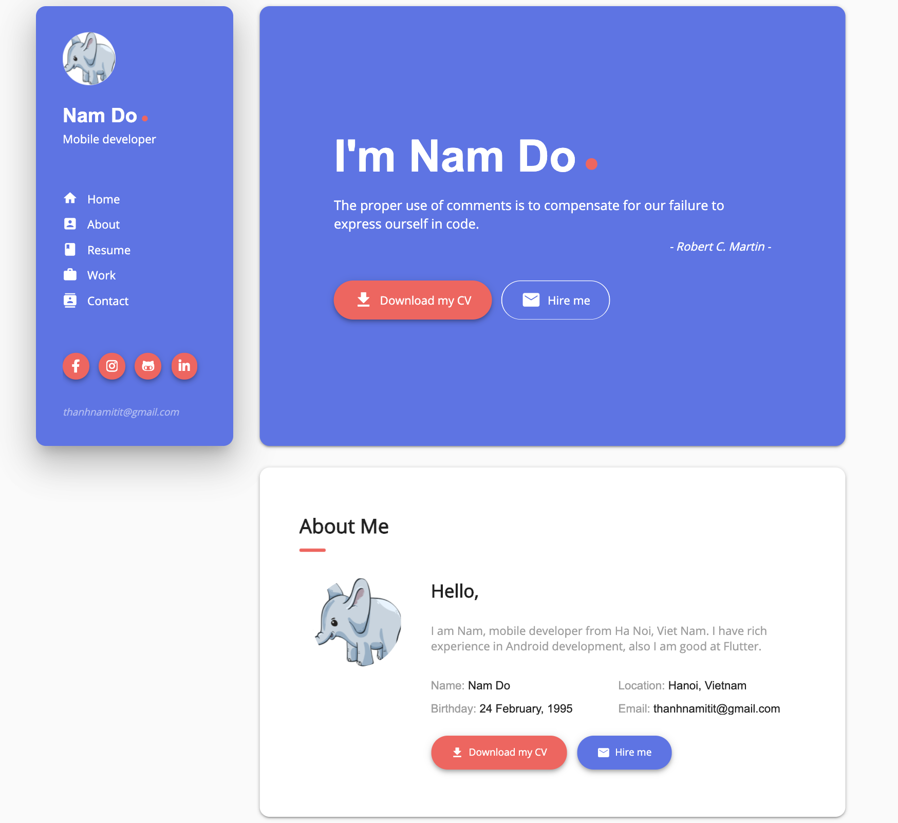

# Flutter - Resume Web Page

Resume Web page in Flutter

## Demo

[thanhnamitit.xyz](https://thanhnamitit.xyz/#/)

## Backend

[message_server.js](https://github.com/thanhnamitit/Flutter-Resume/blob/master/message_server.js)

This is main file of [Firebase cloud funtion](https://firebase.google.com/docs/functions)
. You shoud copy it to your cloud function project, or modify it if you don't want to run your server on firebase cloud

## Screenshot

